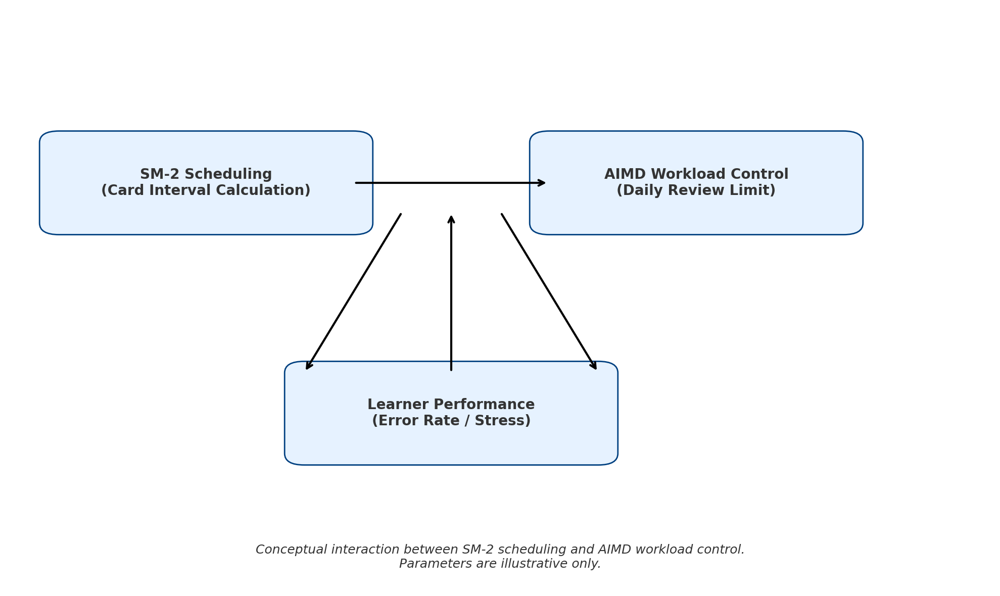
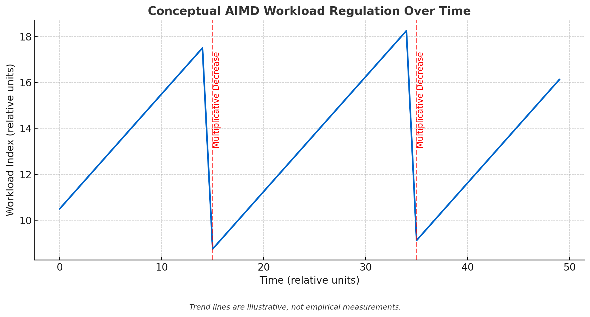

# GRE Quiz SRS

### 專案初衷
背 GRE 太痛苦，想找個藉口偷懶。  
所以做了這套「懶人有效記憶」工具。

我的兩大秘密武器：

- **SM2**：安排複習時間，讓你不會背到睡著還忘光；
- **AIMD**：根據你當天狀況調整練習量，避免被單字海淹死。

不只偷懶成功，還能讓記憶更牢靠，  
但這專案也成了我逃避背書的最大干擾……  

歡迎一起「專業逃避」，順便背點東西！

---

## 專案簡介

本專案是針對 GRE 單字與詞根的**自適應間隔重複記憶系統**（SRS），結合：

- **三階段學習策略**：Blind Test → AIMD 負荷控制 → SM‑2 演算法  
- **AIMD 工作量控制**（Additive Increase / Multiplicative Decrease）動態調整每日練習配額  
- **SM‑2 排程演算法**：根據答題品質計算下一次複習時間  
- **爆練模式**：暫時解除每日配額限制  
- **終端即時負荷視覺化**：進度條呈現學習負荷狀態  
- **多欄位題庫支援**：詞根、單字、例句與翻譯  

> **簡單說明：**  
> SM‑2 負責卡片的最佳複習間隔，  
> AIMD 負責調控每日整體學習負荷，  
> 兩者合力讓你不會燒壞大腦，也不會背不夠。  

---

## 系統架構與設計理念



> SM‑2 和 AIMD 形成迴路回饋，根據你的表現動態調整複習與負荷。（示意圖）

---

## AIMD 負荷變化趨勢（概念示意）



> Additive Increase 緩步增加學習量，  
> Multiplicative Decrease 在壓力大時迅速降低負荷，  
> 確保心理健康與學習效率兼顧。

---

## 環境與安裝

### 系統需求
- Python 3.7 以上
- Windows / macOS / Linux 通用

### 快速安裝
```bash
git clone https://github.com/你的帳號/gre-quiz-srs.git
cd gre-quiz-srs

# 建立虛擬環境（可選）
python -m venv venv
source venv/bin/activate  # Linux/macOS
venv\Scripts\activate     # Windows

# 安裝依賴
pip install -r requirements.txt
````

---

## 題庫格式與用戶群說明

* **核心是 CLI（命令列介面）版本**：輕量、易擴展，方便自動化與進階用戶使用。
* **主要用戶多為非技術背景（非 CS）**：不熟 JSON/CSV，也不習慣命令列操作。
* 因此提供 **Excel 格式題庫（`voc.xlsx`）**，讓你直接用熟悉的介面編輯詞彙與例句，完全零程式門檻。

**貼心提醒：**
請務必**定期備份 `voc.xlsx`**，避免資料意外遺失。

此外，我們在 [Release 頁面](https://github.com/ylin3-learner/GRE-Quiz-SRS/releases) 提供 **GUI 版本**，完全兼容 `voc.xlsx`，且自動備份題庫檔，給不習慣命令列的你最友善的體驗。

---

## 使用說明

啟動程式：

```bash
python quiz.py
```

選單：

* `1` 詞根模式
* `2` 單字模式
* `3` 查看統計
* `4` 切換爆練模式
* `q` 退出並保存

**注意事項：**

* 每題有限時，超時算答錯
* 系統會自動計算複習間隔並保存進度
* 進度存於 `voc.xlsx`，請定期備份

---

## 目錄結構

```
gre-quiz-srs/
├── quiz.py           # 主程式
├── voc.xlsx          # 題庫
├── requirements.txt  # 依賴套件
├── docs/
│   ├── system-architecture.png
│   └── aimd-trend.png
└── README.md
```

---

## requirements.txt 範例

```
pandas>=1.0.0
numpy>=1.18.0
colorama>=0.4.0
openpyxl>=3.0.0
```

---

## 📦 下載

[點我下載最新 GUI 版本](https://github.com/ylin3-learner/GRE-Quiz-SRS/releases/latest/download/QuizApp.zip)

---

## 參考資料

* [SuperMemo SM‑2 Algorithm](https://www.supermemo.com/en/archives1990-2015/english/ol/sm2)
* Jacobson, V., *Congestion Avoidance and Control*, SIGCOMM 1988
* Cepeda, N. J., et al. (2006). *Distributed practice in verbal recall tasks: A review and quantitative synthesis.* Psychological Bulletin, 132(3), 354–380

---

## 貢獻

歡迎提出 Issue 或 PR！
覺得有幫助，別忘了 Star ⭐ 支持！

---

## 聯絡方式

* Email: [husenior11123@gmail.com](mailto:husenior11123@gmail.com)
* GitHub: [https://github.com/ylin3-learner](https://github.com/ylin3-learner)
