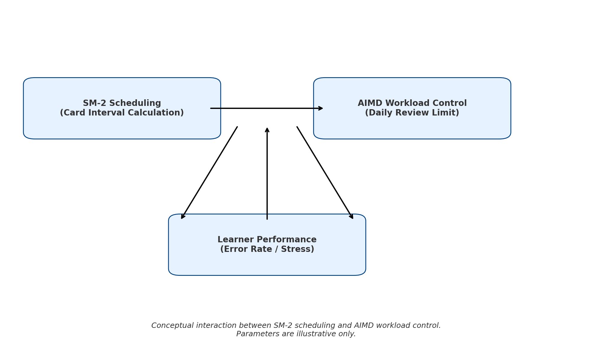
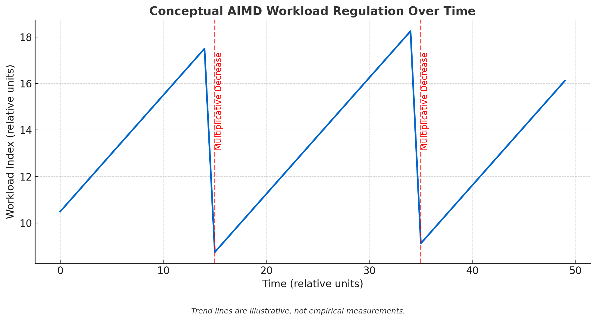

# GRE Quiz SRS

For 中文, see [README.md](README.md)

### Project Motivation
Memorizing GRE vocabulary is painful, so I decided to create a handy tool to make it easier.  
- SM2 manages memory efficiency  
- AIMD prevents drowning in the sea of vocabulary  

No significant progress in memorization, but procrastination reached professional levels.  

A farewell gift to my past self who suffered through vocabulary memorization —  

And to all fellow English majors struggling in the sea of words.

> A farewell gift to my fellow English majors, from someone who escaped to CS but never forgot the pain.

---

## Project Overview

This project is an **adaptive spaced repetition system (SRS)** for GRE vocabulary and roots, combining:

- **Three-stage learning strategy:** Blind Test → AIMD workload control → SM-2 algorithm  
- **AIMD workload control** (Additive Increase / Multiplicative Decrease) dynamically adjusts the daily practice quota  
- **SM-2 scheduling algorithm:** calculates the next review time based on answer quality  
- **Intense mode:** temporarily lifts daily quota restrictions  
- **Real-time terminal workload visualization:** progress bars displaying learning load status  
- **Multi-field question bank support:** roots, vocabulary, example sentences, and translations  

> **In brief:**  
> SM-2 handles the optimal intervals for flashcard reviews,  
> AIMD regulates the overall daily learning workload,  
> Together they prevent brain burnout while ensuring sufficient practice.

---

## System Architecture and Design Philosophy



> SM-2 and AIMD form a feedback loop, dynamically adjusting review schedules and workload based on your performance. (Illustration)

---

## AIMD Workload Trend (Conceptual Illustration)



> Additive Increase gradually raises study load,  
> Multiplicative Decrease rapidly lowers it when stress is high,  
> Ensuring mental health and learning efficiency go hand in hand.

---

## Environment & Installation

### System Requirements
- Python 3.7 or above  
- Cross-platform: Windows / macOS / Linux  

### Quick Installation
```bash
git clone https://github.com/your-username/gre-quiz-srs.git
cd gre-quiz-srs

# (Optional) Create virtual environment
python -m venv venv
source venv/bin/activate  # Linux/macOS
venv\Scripts\activate     # Windows

# Install dependencies
pip install -r requirements.txt
````

---

## Question Bank Format and User Profile

* **Core is a CLI (Command Line Interface) version:** lightweight, easily extendable, suitable for automation and advanced users.
* **Primary users are mostly non-technical (non-CS) background:** unfamiliar with JSON/CSV and command line operations.
* Therefore, an **Excel format question bank (`voc.xlsx`)** is provided, allowing you to edit words and example sentences directly with a familiar interface, zero programming needed.

**Friendly Reminder:**
Please **back up your `voc.xlsx` regularly** to avoid accidental data loss.

Additionally, we offer a **GUI version** on the [Releases page](https://github.com/ylin3-learner/GRE-Quiz-SRS/releases), fully compatible with `voc.xlsx` and featuring automatic backup of question banks, providing the friendliest experience for those uncomfortable with command line.

---

## Usage

Start the program:

```bash
python quiz.py
```

Menu:

* `1` Root mode
* `2` Vocabulary mode
* `3` View statistics
* `4` Toggle intense mode
* `q` Quit and save

**Notes:**

* Each question has a time limit; timeout counts as incorrect
* The system automatically calculates review intervals and saves progress
* Progress is saved in `voc.xlsx`; please back up regularly

---

## Directory Structure

```
gre-quiz-srs/
├── quiz.py           # Main program  
├── voc.xlsx          # Question bank  
├── requirements.txt  # Dependencies  
├── docs/
│   ├── system-architecture.png  
│   └── aimd-trend.png  
└── README.md
```

---

## Sample requirements.txt

```
pandas>=1.0.0
numpy>=1.18.0
colorama>=0.4.0
openpyxl>=3.0.0
```

---

## 📦 Download

[Click here to download the latest GUI version](https://github.com/ylin3-learner/GRE-Quiz-SRS/releases/latest/download/QuizApp.zip)

---

## References

* [SuperMemo SM‑2 Algorithm](https://www.supermemo.com/en/archives1990-2015/english/ol/sm2)
* Jacobson, V., *Congestion Avoidance and Control*, SIGCOMM 1988
* Cepeda, N. J., et al. (2006). *Distributed practice in verbal recall tasks: A review and quantitative synthesis.* Psychological Bulletin, 132(3), 354–380

---

## Contributing

Feel free to open Issues or Pull Requests!
If you find this project helpful, don’t forget to Star ⭐ support!

---

## Contact

* Email: [husenior11123@gmail.com](mailto:husenior11123@gmail.com)
* GitHub: [https://github.com/ylin3-learner](https://github.com/ylin3-learner)
